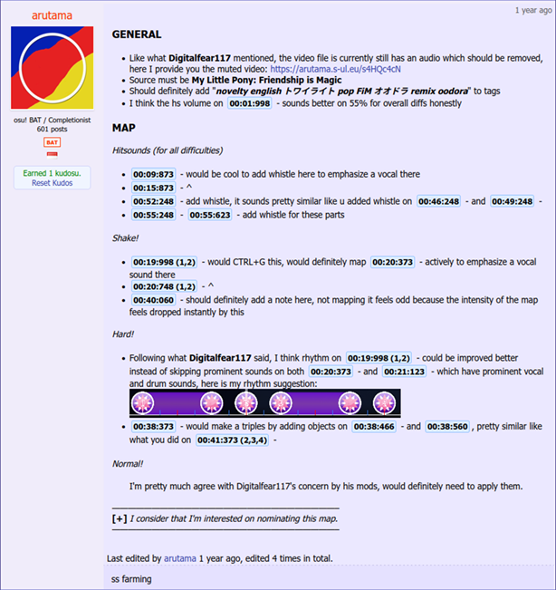
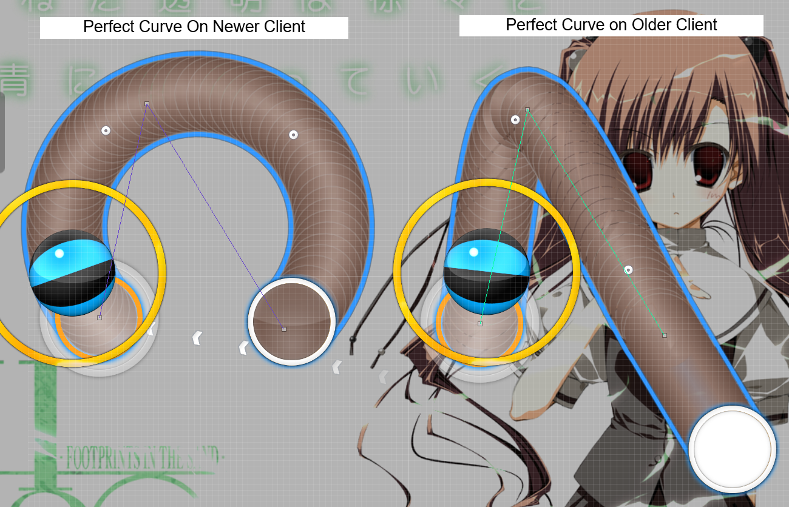
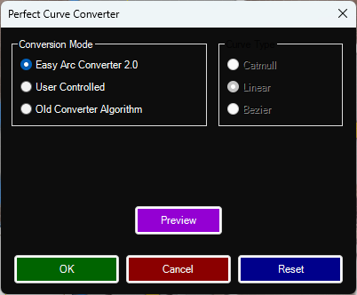
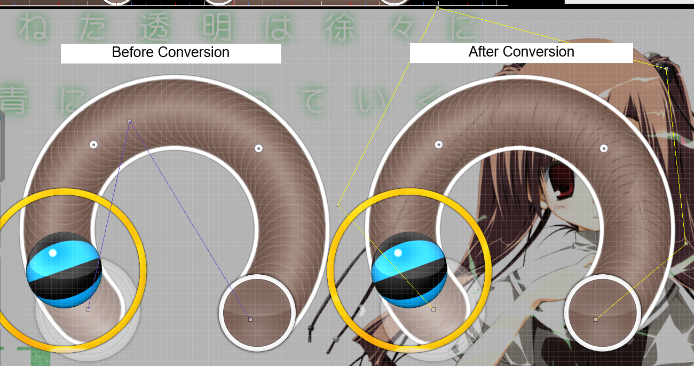

# Beatmap Approval Team Guide

The *Beatmap Approval Team* (BAT) is responsible for ensuring the quality and integrity of all
Beatmaps submitted for ranking, approval, or loved status on Titanic. This document outlines
BAT responsibilities, nomination procedures, and general best practices.

## Responsibilities of BAT Members

### General Tasks

Every BAT member is expected to remain active and engaged in the review process. At
minimum, each member must mod and nominate at least **one map every three months**. Those
who fail to meet this activity requirement will be removed from the team due to inactivity, though
they are welcome to reapply after two months. Likewise, members who consistently overlook
issues or approve maps of **poor quality** may be removed to protect the integrity of the ranking
process.

BAT members will review Beatmaps uploaded through the Titanic [Beatmap Submission System](https://osu.ppy.sh/wiki/en/Beatmapping/Beatmap_submission)
(BSS) and those posted in the [Map Requests Subforum](https://osu.titanic.sh/forum/11). They must ensure that each map
follows all ranking criteria. This includes verifying things such as perfect curve conversions,
proper lead-in times, and overall playability on older clients.

If the requester of a map happens to be a BAT member, it's *their responsibility* to correct any
identified problems themselves before nominating the map. This ensures that all maps, even
those handled internally, meet the same quality standards.

### Communication & Reporting

For communication, all internal BAT matters and questions should be discussed in the
\#beatmap-approval-team channel on Discord. General inquiries or concerns from players or
mappers can be directed to the [#mapping](https://discord.com/channels/1152925764262580236/1238455839153717319) channel or the [Mapping Discussion](https://osu.titanic.sh/forum/13) forum on Titanic's
website.

## Nominating and Reviewing Maps

### Titanic Originals

Maps sent to Titanics BSS should be reviewed in their respective Beatmap forum threads for
rankability concerns, subjective issues, and anything that could help improve the map.

BATs should be respectful to mappers. **They cannot put down others for their mistakes**. Today's mappers
may be tomorrow's BATs.

The most annoying issues to fix are the Perfect Curve Sliders. Any slider that makes a circle or
C shape with only 3 points is likely to play incorrectly on old clients. For maps using these types
of sliders, BATs should send the mapper converted versions of the map using our Perfect Curve to Bezier
converter.

#### Perfect Curves Slider Converter

Perfect curve sliders are not compatible with older clients, and will instead become catmull
sliders. This will break replays, and cause sr differences for clients before 20121003shine.test.
Digital Client offers a converter that will give 100% accurate results in very few clicks.

 

### Map Requests

For **unranked** Bancho maps, BAT members should carefully check several compatibility areas:
storyboard functionality, perfect curve slider shapes, manual lead-in times, and the general
ranking criteria. For versions of maps before *v10*, open the map in a client version that matches
the one used when it was last updated. This ensures that any changes made use the
correct *.osu* version format. You can find help on this in the [Editor Differences wiki page](https://osu.titanic.sh/wiki/en/Editor_Differences).

For **ranked maps** from Bancho, the process is simpler. The only thing that needs to be checked
is *Storyboard Compatibility*. Do not alter other elements like sliders or lead-in times. The aim is
to keep ranked maps as faithful to their originals as possible.

**DO NOT** nominate the map on the Beatmap listing.
Instead, manually rank the map through the BanchoBot command once all nominations required are reached in the map request thread.

Individual difficulties can have different ranked status.

## Ranking a Beatmap

If a BAT believes that the Beatmap they are reviewing is eligible for the Ranked section, they can
click the green "**Nominate this beatmap (bubble)**" link. Once the Beatmap has enough
nominations, they will be able to use the "**Update the status to 'Qualified'**" link. This will
proceed to automatically put the Beatmap into the "*Ranked*" or "*Approved*" section, depending
on the Beatmap length.

If a BAT found an issue with a nominated/qualified map, they can either **"Reset all nominations
from this beatmap (Pop Bubble)**" or "**Disqualify this beatmap**". They will then proceed to explain
their reason for disapproval in the Beatmap forum topic.

BATs are also able to update the status for an *individual Beatmap*. Simply click the "Difficulty
Status Updates" dropdown, and switch the status. Finally, hit the "Update" button and the
Beatmap should have the new status.

## Nomination Rules

Maps follow a few general nomination rules depending on their type and length. **Loved** maps
skip the normal seven-day qualification period. **Approved** maps, which are those with over five
minutes of drain time, require *three* BAT members for the main mode and one additional BAT for
each extra mode included in the set. For **Ranked** and **Loved** maps, only *two* BATs are needed
for the main mode and one more per additional mode.

Members who are designated as "Hybrid BATs" can nominate for two game modes
simultaneously with a single nomination. BAT managers can act as **secondary nominators** for
less common modes such as Mania, Taiko, or CtB, helping to balance review coverage across
all modes.

**BATs are not allowed to nominate their own Beatmaps, including both their own maps
and map requests they have personally submitted. However, they may nominate a
Bancho map that they’ve reuploaded solely for technical fixes, provided they were not
the one who originally requested it.**
