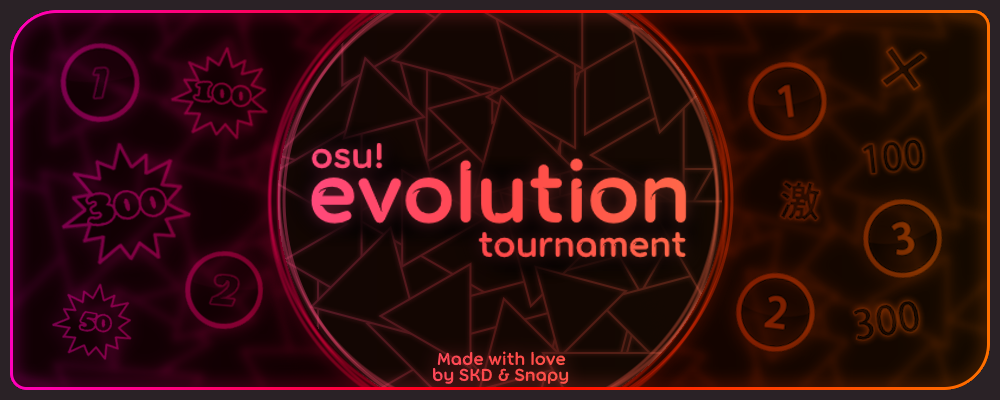

# osu!evolution tournament

**osu!evolution tournament** was an osu!standard 2v2 team tournament hosted by [Sanyek KD] and [Snapy]. It was the first tournament held on Titanic, running from August 8th to October 12th, 2025. The event was open to players ranked between 80,000 and 400,000 without a rank buffer.

The tournament was built around the idea of _evolution_: each stage used maps from a newer period of osu! history, while the first three stages moved through progressively newer historical clients on Titanic. The tournament then switched to the stable client and ScoreV2 for the quarterfinals onward.

[TOC]

## Links

- [Forum Post (archived)](https://web.archive.org/web/20250605155416/https://osu.ppy.sh/community/forums/topics/2084455)
- [Rules](https://docs.google.com/document/d/1hmnkXghNxwpUJiDZq0WdAyyKOiJjK6IEjKlEaewOGBE/edit)
- [Main Sheet](https://docs.google.com/spreadsheets/d/1zmnjY6hHg1IRIa4_0X9OIFogLCsu_feEoeLz8k4MfGc/edit)
- [Statistics Sheet](https://docs.google.com/spreadsheets/d/14YnK_tBtOobLhNlmlQcfcO0be5EiWW1jJ8cuAgS-tSw/edit)
- [Challonge Bracket](https://challonge.com/osuevolutiontourney)

## Tournament format

| Stage         | Map era   | Client       | Scoring | Match format                  |
| ------------- | --------- | ------------ | ------- | ----------------------------- |
| Qualifiers    | 2007-2011 | b1704        | ScoreV1 | One full pool playthrough     |
| Swiss 1       | 2012-2013 | b20131129.1  | ScoreV1 | Best of 9, 1 ban, 1 protect   |
| Swiss 2       | 2014-2015 | b20150812.11 | ScoreV1 | Best of 9, 1 ban, 1 protect   |
| Quarterfinals | 2016-2018 | Stable       | ScoreV2 | Best of 11, 2 bans, 1 protect |
| Semifinals    | 2019-2021 | Stable       | ScoreV2 | Best of 11, 2 bans, 1 protect |
| Finals        | 2022-2023 | Stable       | ScoreV2 | Best of 13, 2 bans, 1 protect |
| Grand Finals  | 2024-2025 | Stable       | ScoreV2 | Best of 13, 2 bans, 1 protect |

Qualifiers, Swiss 1, and Swiss 2 were played on Titanic. The target map eras were relaxed slightly as needed for a better pool, and [osu!lazer](https://osu.ppy.sh/wiki/en/Help_centre/Upgrading_to_lazer) was removed from the later stages at the players' request. The top 16 teams from Qualifiers advanced to the Swiss stage, after which the top eight proceeded to the double-elimination bracket. Although the Grand Finals were originally scheduled to end on October 5th, _Gosling appreciation club_ forced a bracket reset and won the deciding match one week later.

## Schedule

| Event                                     | Date                               |
| ----------------------------------------- | ---------------------------------- |
| Staff registrations opened                | May 26th, 2025                     |
| Team registrations                        | July 7th - August 3rd, 2025        |
| Screening and Qualifiers mappool showcase | August 4th, 2025                   |
| Qualifiers                                | August 4th - 10th, 2025            |
| Swiss 1                                   | August 11th - 24th, 2025           |
| Swiss 2                                   | August 25th - September 7th, 2025  |
| Quarterfinals                             | September 8th - 14th, 2025         |
| Semifinals                                | September 15th - 21st, 2025        |
| Finals                                    | September 22nd - 28th, 2025        |
| Grand Finals                              | September 29th - October 5th, 2025 |
| Grand Finals bracket reset                | October 12th, 2025                 |

## Organization

| Position     | Member(s)                                                                                                                                                              |
| ------------ | ---------------------------------------------------------------------------------------------------------------------------------------------------------------------- |
| Hosts        | [Sanyek KD]                                                                                                                                                            |
| Graphics     | [Sanyek KD]                                                                                                                                                            |
| Mapper       | [CLICUS]                                                                                                                                                               |
| Mappoolers   | [dxprxsslve], [Emiko Nin], [matthijs661], [Sanyek KD], [vanikou], [Zetsu-], [-\[ FmB \]-], [\[zeit\]], [BeZonaurul], [bumerang], [osunhulol], [roseykira]              |
| Streamers    | [MiquelVZLA], [Sanyek KD]                                                                                                                                              |
| Commentators | [Amamiya Mitoro], [Emiko Nin], [Mavosiik], [MiquelVZLA], [Sanyek KD], [Maiji], [Filoxen]                                                                               |
| Referees     | [- Kubii -], [-\[ FmB \]-], [Amamiya Mitoro], [Cessna], [dxprxsslve], [GS-BREAK], [Mavosiik], [OpTiMist777], [osunhulol], [roseykira], [Ryshult], [Sanyek KD], [WEARY] |

## Participants

28 teams registered and 22 recorded a Qualifiers result. The top 16 seeded teams advanced to the Swiss stage.

| Qualifier seed | Team                                     | Roster                                          |
| :------------: | ---------------------------------------- | ----------------------------------------------- |
|       1        | Gosling appreciation club                | [Har_ka], [cant tap], [Qbaa]                    |
|       2        | Unlimited Bacon, but No Bacon            | [Colon], [Maiji], [notaimingxd]                 |
|       3        | Red Sister Fan Club                      | [Worst Aim], [Krla], [R1zzy2]                   |
|       4        | We luv blue archive                      | [XC1432], [MRSC7556], [KiTRa-Rbc]               |
|       5        | i cant hold Newton                       | [Typchen], [sparky_123], [hieuchan]             |
|       6        | Sparkling Suisei                         | [aSparkle], [Sparkle], [Kagura Suzuki]          |
|       7        | meowmeowfans                             | [AcidBlue], [dobrynych], [suspee]               |
|       8        | The new cangaço                          | [yehifb], [otavi0], [itikki]                    |
|       9        | Hydrog3n                                 | [Tomori-desu], [OmegaTrollHard]                 |
|       10       | Paradise                                 | [X_z_e_r_o_X], [JoelNGs]                        |
|       11       | I think we like uma musume               | [Hiyuki], [Karistia], [-Rak]                    |
|       12       | FA Team 4                                | [Ren245], [zreiF]                               |
|       13       | Tayanes State College Of The Philippines | [Pencil Knight], [Makausap], [Omutatsu_]        |
|       14       | Flaklypa Boys                            | [XxrobuxX], [otsai suzuya]                      |
|       15       | Hold me (While I SB)                     | [MrW0ong], [Tian Ling], [crazykirill]           |
|       16       | uerghhhhh shut up uuaaarrghh             | [tiurla], [UKT]                                 |
|       17       | 🔥Fire Mafia🔥                           | [tacoman007], [pistachia], [GratefulCrane]      |
|       18       | Southeast A+sians                        | [ayahpple], [\[TCD\] Shocked], [RoastedChikens] |
|       19       | optimistic enjoyers                      | [OpTiMist777], [Flutterheart], [Karrotts_0]     |
|       20       | asian girls lovers                       | [PahaPlay], [kr1vite], [iemmisaki]              |
|       21       | ghufi ghooburrz³                         | [WEARY], [chlortal], [Ficshl]                   |
|       22       | French NWC : Remake                      | [Haze_Eclipse], [Emadarch], [thekiri08]         |
|       -        | COMBOGAMING3000                          | [lagerzzz], [Amur_]                             |
|       -        | FA Team 1                                | [Tintinwastaken], [- Toothless -], [Nanally]    |
|       -        | KrutieCheyi                              | [ddyo], [KrutoiCheI], [SoSadOff]                |
|       -        | Жмыхнутые                                | [russist1], [Mihalkekich], [moonl1ght1]         |
|       -        | Miss or Die                              | [LittleFireHuTao], [Fructoza], [Misha_]         |
|       -        | too freaky                               | [Robofreak], [K1an65], [WanHigh]                |

## Podium

|  Place | Team                              | Roster                                 |                                 Cosmetic                                 |
| -----: | --------------------------------- | -------------------------------------- | :----------------------------------------------------------------------: |
| 1st 🥇 | **Gosling appreciation club**     | [Har_ka], [cant tap], [Qbaa]           | [Badge](https://osu.titanic.sh/images/badges/tournaments/evo/1st@8x.png) |
| 2nd 🥈 | **Sparkling Suisei**              | [aSparkle], [Sparkle], [Kagura Suzuki] | [Badge](https://osu.titanic.sh/images/badges/tournaments/evo/2nd@8x.png) |
| 3rd 🥉 | **Unlimited Bacon, but No Bacon** | [Colon], [Maiji], [notaimingxd]        | [Badge](https://osu.titanic.sh/images/badges/tournaments/evo/3rd@8x.png) |
| 4th 🏅 | **i cant hold Newton**            | [Typchen], [sparky_123], [hieuchan]    |                                    -                                     |

## Statistics

The [statistics sheet](https://docs.google.com/spreadsheets/d/14YnK_tBtOobLhNlmlQcfcO0be5EiWW1jJ8cuAgS-tSw/edit) ranks team performances by _z-sum_ and individual performances by _match cost_. Raw scores should not be compared across stages, particularly because the tournament switched from [ScoreV1 to ScoreV2](https://osu.ppy.sh/wiki/en/Gameplay/Score) for the Quarterfinals.

| Stage         | Leading team                  | Z-sum | Average accuracy | Leading player | Match cost | Average accuracy |
| ------------- | ----------------------------- | ----: | ---------------: | -------------- | ---------: | ---------------: |
| Qualifiers    | Gosling appreciation club     | 21.23 |           93.26% | Semicolon      |       4.81 |           97.55% |
| Swiss 1       | Unlimited Bacon, but No Bacon | 11.12 |           97.34% | Everesence     |       1.75 |           98.22% |
| Swiss 2       | FA Team 4                     | 10.92 |           95.16% | Everesence     |       1.82 |           97.15% |
| Quarterfinals | Sparkling Suisei              |  7.07 |           94.42% | Colon          |       1.69 |           96.55% |
| Semifinals    | Sparkling Suisei              |  5.15 |           94.82% | Colon          |       1.43 |           94.79% |
| Finals        | Sparkling Suisei              |  6.16 |           90.97% | Colon          |       1.45 |           92.67% |
| Grand Finals  | Gosling appreciation club     |  5.31 |           90.57% | Maiji          |       0.75 |           87.31% |

## Mappools

Every pool included a stage-specific **Legendary (LG)** pick. These maps represented an iconic map or style from the stage's period and could use _special rules_.

| Stage         | Legendary-pick rule                                                                                |
| ------------- | -------------------------------------------------------------------------------------------------- |
| Qualifiers    | Easy was forced                                                                                    |
| Swiss 1       | Hard Rock was forced, Hidden could be added                                                        |
| Swiss 2       | Freemod, without forcemod.                                                                         |
| Quarterfinals | Freemod                                                                                            |
| Semifinals    | Forcemod                                                                                           |
| Finals        | Relax and freemod were forced, speed mods required mutual agreement, and the lowest miss count won |
| Grand Finals  | Relax and freemod were forced, and the highest accuracy won                                        |

### Qualifiers (2007-2011)

Played on [b1704](https://osu.titanic.sh/download?category=2010).

| Mod | Beatmap                                                        | Mapper       | Details                 |
| :-: | -------------------------------------------------------------- | ------------ | ----------------------- |
| NM1 | [IOSYS - Accept Bloody Fate \[Lunatic\]]                       | Louis Cyphre | 3:09, 190 BPM, 5.25*    |
| NM2 | [sakuzyo - VALLISTA \[Another\]]                               | Shiirn       | 1:38, 180 BPM, 5.25*    |
| NM3 | [Wotamin - Rubik's Cube \[Puzzle\]]                            | Kite         | 3:01, 280 BPM, 4.88*    |
| NM4 | [Kalafina - Sprinter \[SOGABAKAMO\]]                           | ccbp         | 3:25, 160 BPM, 4.67*    |
| HD1 | [Solid Inc. - What I Found (State Function Remix) \[New Day\]] | galvenize    | 4:14, 175 BPM, 5.10*    |
| HD2 | [xi - Halcyon \[Hyper\]]                                       | gowww        | 1:52, 191 BPM, 4.80*    |
| HR1 | [Asriel - Kegare Naki Yume \[Yume\]]                           | KanaRin      | 3:53, 223 BPM, 5.13*    |
| HR2 | [Nightcore - Superstar \[Insane\]]                             | osuplayer111 | 2:23, 174.24 BPM, 5.27* |
| DT1 | [Toku-P ft. ryo - SPiCa x Melt \[Insane Collab\]]              | Krisom       | 2:06, 246 BPM, 5.38*    |
| DT2 | [Hatsune Miku - Symphony \[Dis\]]                              | Disoy        | 1:31, 210 BPM, 5.46*    |
| LG1 | [Hommarju feat. Latte - masterpiece \[ignore's Chaos\]]        | simplistiC   | 2:37, 180 BPM, 4.68*    |

### Swiss 1 (2012-2013)

Played on [b20131129.1](https://osu.titanic.sh/download?category=2013).

| Mod | Beatmap                                                               | Mapper      | Details                 |
| :-: | --------------------------------------------------------------------- | ----------- | ----------------------- |
| NM1 | [Dee! feat. Nomiya Ayumi - Hito Ayumishi Unmei ni Yosete \[Lunatic\]] | Mixagji     | 3:09, 175 BPM, 5.11*    |
| NM2 | [Cres - End Time \[Another\]]                                         | Fear        | 2:08, 180 BPM, 5.01*    |
| NM3 | [yuikonnu - Uchouten Vivace \[SCV's Insane\]]                         | Guy         | 3:14, 266 BPM, 4.73*    |
| NM4 | [Lapfox Trax feat. guilhox - Lapfoxed Forever \[Insane\]]             | Blue Dragon | 3:35, 220 BPM, 4.99*    |
| HD1 | [USAO - ZED \[Nyquill's Another\]]                                    | Mr Color    | 1:37, 190 BPM, 4.86*    |
| HD2 | [Yamano Satoko - Doraemon no Uta \[615's Insane\]]                    | Troogle     | 2:33, 120.65 BPM, 4.55* |
| HR1 | [Last Note. - Caramel Heaven \[Nyquill's Insane\]]                    | Snepif      | 3:30, 194 BPM, 5.07*    |
| HR2 | [MAKI - Wind Climbing ~ Kaze ni Asobarete \[Wind\]]                   | jacob       | 1:57, 144 BPM, 4.69*    |
| DT1 | [Nishino Kana - Story \[Our Story\]]                                  | Autumn      | 2:31, 118.5 BPM, 5.04*  |
| DT2 | [ZUN - Kobito of the Shining Needle ~ Little Princess \[Hard\]]       | sjoy        | 2:12, 246 BPM, 5.20*    |
| FM1 | [Kola Kid - square spooner fisher pusher \[Endless\]]                 | Kert        | 2:16, 160 BPM, 4.48*    |
| FM2 | [Rin - Spring of Dreams \[Lunatic\]]                                  | jyc-Binggan | 2:46, 128 BPM, 4.30*    |
| LG1 | [Feint - Tower Of Heaven (You Are Slaves) \[Another\]]                | eLy         | 2:35, 175 BPM, 4.63*    |
| TB1 | [Feint - Times Like These (Fracture Design Remix) \[Happy Times\]]    | Katty Pie   | 6:11, 172 BPM, 5.31*    |

### Swiss 2 (2014-2015)

Played on [b20150812.11](https://osu.titanic.sh/download?category=2015).

| Mod | Beatmap                                                               | Mapper        | Details                |
| :-: | --------------------------------------------------------------------- | ------------- | ---------------------- |
| NM1 | [Yucha-P - Thieves Night Trick \[Extra\]]                             | tutuhaha      | 3:24, 218 BPM, 5.23*   |
| NM2 | [Memme - NEW Astronomas \[Extra\]]                                    | Charles445    | 1:47, 160 BPM, 5.27*   |
| NM3 | [M2U - Gypsy Tronic \[Collab Insane\]]                                | Gomo Pslvarh  | 2:22, 125 BPM, 5.11*   |
| NM4 | [Function Phantom - Neuronecia \[iyasine's Insane\]]                  | Amamiya Yuko  | 2:46, 177 BPM, 5.16*   |
| NM5 | [Pierce The Veil - King For A Day (feat Kellin Quinn) \[Insanother\]] | pishifat      | 2:00, 226 BPM, 4.97*   |
| HD1 | [Qrispy Joybox - licca \[yf's Another\]]                              | Minakami Yuki | 1:47, 196 BPM, 5.07*   |
| HD2 | [Hanatan - Kitsune no Yomeiri \[Kiiwa's Insane\]]                     | Beren         | 2:59, 175 BPM, 4.53*   |
| HR1 | [ALiCE'S EMOTiON - Dark Flight Dreamer \[Lunatic\]]                   | Natsu         | 2:59, 189 BPM, 5.22*   |
| HR2 | [SHK - Identity Part 5 \[Kami's Another\]]                            | \[Twinkle\]   | 1:59, 140 BPM, 5.26*   |
| DT1 | [Haruna Luna - Startear \[Insane\]]                                   | Melophobia    | 2:59, 201 BPM, 5.43*   |
| DT2 | [BlackYooh vs. siromaru - BLACK or WHITE? \[ADVANCED+\]]              | Fast          | 1:04, 277.5 BPM, 5.25* |
| DT3 | [Savant - Melody Circus \[4-bit\]]                                    | AndreasHD     | 1:41, 205.5 BPM, 5.27* |
| FM1 | [CENOB1TE - Onslaught \[kyversible-insane_\]]                         | Irreversible  | 2:46, 140 BPM, 4.93*   |
| FM2 | [Anamanaguchi - Blackout City \[Insane\]]                             | Sushi         | 3:11, 187.5 BPM, 4.37* |
| LG1 | [xi - Blue Zenith \[RLC's Insane\]]                                   | Asphyxia      | 3:49, 200 BPM, 5.52*   |
| TB1 | [kors k - Playing With Fire (Sota Fujimori Remix) \[Pyrotechnics\]]   | xlni          | 4:57, 162 BPM, 5.41*   |

### Quarterfinals (2016-2018)

Played on [osu! stable](https://osu.ppy.sh/home/download).

| Mod | Beatmap                                                                              | Mapper       | Details                |
| :-: | ------------------------------------------------------------------------------------ | ------------ | ---------------------- |
| NM1 | [nano - INFINITY ZERO \[Kihhou's Extra\]]                                            | Giralda      | 3:48, 188 BPM, 5.53*   |
| NM2 | [xi - ANiMA \[LV.11\]]                                                               | liaoxingyao  | 1:50, 183.5 BPM, 5.57* |
| NM3 | [Kaneko Chiharu - iLLness LiLin \[Pono's INFINITE\]]                                 | Kroytz       | 1:53, 280 BPM, 5.37*   |
| NM4 | [factal - Wake Up While Sleeping \[Ambrew's Extreme\]]                               | Sharu        | 2:49, 160 BPM, 5.26*   |
| NM5 | [Seeed - Ding \[Deramok's Hidden Extra\]]                                            | IceKalt      | 3:04, 117 BPM, 4.81*   |
| HD1 | [Getty vs. DJ DiA - DropZ-Line- \[Wormi's Another\]]                                 | Realazy      | 1:49, 200 BPM, 5.42*   |
| HD2 | [dark cat - BUBBLE TEA (feat. juu & cinders) \[Insane\]]                             | Regou        | 3:05, 160 BPM, 5.11*   |
| HD3 | [Nanahoshi Kangengakudan feat.Matsushita - Dance Number o Tomo ni \[deetz' Insane\]] | pkk          | 3:35, 296 BPM, 5.10*   |
| HR1 | [JUNNA - Here \[Testo's Insane\]]                                                    | Mirash       | 3:18, 72 BPM, 5.39*    |
| HR2 | [Owl City - Dreams Don't Turn To Dust \[Dreamer\]]                                   | TheMefisto   | 2:52, 90 BPM, 5.28*    |
| HR3 | [sakuzyo - Laplace \[buhei's Insane\]]                                               | Hakurei Yoru | 1:41, 155 BPM, 5.43*   |
| DT1 | [Yunomi - Tokyo Snorkel (feat. nicamoq) \[Hard\]]                                    | bigfrog      | 1:45, 240 BPM, 5.53*   |
| DT2 | [Cranky - Hanaarashi \[Hard\]]                                                       | Mirash       | 2:31, 255 BPM, 5.42*   |
| DT3 | [PSYQUI - Hype feat. Such (lapix Remix) \[Hard\]]                                    | Mir          | 2:43, 262.5 BPM, 5.38* |
| FM1 | [Camellia feat. Nanahira - Bassdrop Freaks (2018 "Redrop" ver.) \[LCFC's Insane\]]   | Mir          | 4:15, 179 BPM, 5.10*   |
| FM2 | [Akiyama Uni - Kaoru Juyouka \[Lunatic\]]                                            | Hollow Wings | 1:24, 138 BPM, 4.74*   |
| FM3 | [Nekomata Master+ - Funny shuffle \[pishi's Extra\]]                                 | lcfc         | 1:39, 115 BPM, 4.97*   |
| LG1 | [Halozy - Kikoku Doukoku Jigokuraku \[Notch Hell\]]                                  | Hollow Wings | 5:42, 155 BPM, 5.49*   |
| TB1 | [PSYQUI - Hype feat. Such \[Dreamer\]]                                               | NyarkoO      | 5:00, 172 BPM, 5.71*   |

### Semifinals (2019-2021)

Played on [osu! stable](https://osu.ppy.sh/home/download).

| Mod | Beatmap                                                                                        | Mapper       | Details                 |
| :-: | ---------------------------------------------------------------------------------------------- | ------------ | ----------------------- |
| NM1 | [SycAmour - Calm Down Juliet (What A Drama Queen) \[banter's Extra\]]                          | Maaadbot     | 4:05, 212 BPM, 5.71*    |
| NM2 | [NIWASHI - Kemuri \[Extra\]]                                                                   | Down         | 1:53, 170 BPM, 5.70*    |
| NM3 | [Dirty Androids - Midnight Lady \[Cub's Expert\]]                                              | Pentori      | 1:55, 128 BPM, 5.32*    |
| NM4 | [sakuraburst - Glacierfall (Park Remix) \[Frostbite\]]                                         | carc1nogen   | 1:59, 170 BPM, 5.49*    |
| NM5 | [Zmey Gorynich - Sorochinskaya Yarmarka \[Daiyousei's Extra\]]                                 | Mazzerin     | 3:26, 220 BPM, 5.75*    |
| NM6 | [BEMANI Sound Team "Nekomata Master" - Life is beautiful \[Another\]]                          | anna apple   | 2:00, 155 BPM, 4.81*    |
| HD1 | [Endorfin. & Feryquitous - Luminous Rage -Feryquitous OrderBless Remix- \[Hems Flutter Away\]] | Miura        | 2:45, 179 BPM, 5.59*    |
| HD2 | [Maison book girl - snow irony_ \[deppy's insane_\]]                                           | newton-      | 4:03, 170 BPM, 4.30*    |
| HD3 | [Balduin & Wolfgang Lohr (feat. Alanna) - Dizzy (Radio Edit) \[Repertoire\]]                   | Arastelia    | 2:32, 125 BPM, 5.45*    |
| HR1 | [Aimer - twoface \[Extra\]]                                                                    | Delis        | 2:58, 183 BPM, 5.69*    |
| HR2 | [ARForest - Infection \[Eulogy\]]                                                              | Niva         | 3:22, 170 BPM, 5.46*    |
| HR3 | [BEMANI Sound Team "Expander" - STOIC HYPOTHESIS \[Insane\]]                                   | Feiri        | 1:59, 170 BPM, 5.33*    |
| DT1 | [Wednesday Campanella - Melos \[Hyper\]]                                                       | Striderin    | 2:24, 240 BPM, 5.70*    |
| DT2 | [penoreri - Sulfur \[Nao's Hard\]]                                                             | Realazy      | 1:13, 273 BPM, 5.70*    |
| DT3 | [lapix - Horizon Blue feat. Kanata.N \[Hard\]]                                                 | Mir          | 2:18, 229.5 BPM, 5.41*  |
| FM1 | [Camellia - FLYING OUT TO THE SKY (Cut Ver.) \[OTOSAKA'S INSANE\]]                             | Ryuusei Aika | 2:12, 244 BPM, 5.22*    |
| FM2 | [Aiobahn - Towa no Utage (w/ YUC'e) \[TANUKI Remix\] \[Another\]]                              | AJT          | 2:42, 170 BPM, 5.00*    |
| FM3 | [Camellia - Towards The Horizon \[Another\]]                                                   | Seolv        | 1:56, 154.38 BPM, 5.22* |
| LG1 | [sabi - true DJ MAG top ranker's song Zenpen (katagiri Remix) \[Scub x Nathan's Insane\]]      | Nathan       | 4:43, 170 BPM, 5.33*    |
| TB1 | [kors k - New Lights (Extended Mix) \[Collab\]]                                                | keevy        | 5:46, 175 BPM, 5.96*    |

### Finals (2022-2023)

Played on [osu! stable](https://osu.ppy.sh/home/download).

| Mod | Beatmap                                                                                   | Mapper          | Details                 |
| :-: | ----------------------------------------------------------------------------------------- | --------------- | ----------------------- |
| NM1 | [Feryquitous feat. Aitsuki Nakuru - Fake \[dawg's Extra\]]                                | captin1         | 3:50, 210 BPM, 5.89*    |
| NM2 | [Presti - Veritas \[Veritas -\]]                                                          | Kyle Y          | 2:23, 175 BPM, 5.97*    |
| NM3 | [kors k - Insane Techniques \[Yokesma's Expert\]]                                         | Plasma          | 2:01, 146 BPM, 5.65*    |
| NM4 | [leroy - fuuuuck we were supposed to wear argyle \[Extra\]]                               | pip             | 2:10, 170 BPM, 5.55*    |
| NM5 | [Cinamoro - Paleturquoise \[Yokes' Extra\]]                                               | PaRaDogi        | 1:27, 215.5 BPM, 5.87*  |
| NM6 | [onoken - Lisrim \[Delette's Special Extreme\]]                                           | milr_           | 2:02, 172 BPM, 5.31*    |
| HD1 | [Camellia - Fly to night, tonight \[Asa's Expert\]]                                       | My Angel Watame | 4:16, 132 BPM, 5.53*    |
| HD2 | [Kairiki bear feat. Hatsune Miku - Starry Start \[Starstruck (CS4 Edit)\]]                | Ixcors          | 2:31, 181 BPM, 5.14*    |
| HD3 | [:) feat. KAFU - Egonomy \[Shiny Braixen's XwXpert\]]                                     | Ryuusei Aika    | 2:10, 175 BPM, 5.69*    |
| HR1 | [7_7 - ;w; \[Extra\]]                                                                     | fllecc          | 3:09, 174 BPM, 5.95*    |
| HR2 | [leroy - the dariacore to YTP pipeline \[noin's insane\]]                                 | Silverboxer     | 2:06, 193 BPM, 5.42*    |
| HR3 | [Polyphia - Playing God \[NeKro's Insane\]]                                               | Mir             | 2:35, 137 BPM, 5.44*    |
| DT1 | [Sawai Miku - Gomen ne, Iiko ja Irarenai. \[KeyWee's Insane\]]                            | Riana           | 2:54, 232.5 BPM, 5.92*  |
| DT2 | [Hamu - Lemrina \[Insane\]]                                                               | Usaha           | 1:18, 255 BPM, 6.05*    |
| DT3 | [Utsu-P - Kanbanmusume no Warufuzake \[Local's Light Insane\]]                            | Net0            | 2:15, 225 BPM, 5.83*    |
| DT4 | [Down - Ekoro \[Light Insane\]]                                                           | Down            | 1:03, 247.5 BPM, 5.67*  |
| FM1 | [Nakiri Ayame - Yume Hanabi \[Battle's Expert\]]                                          | Petal           | 3:06, 165 BPM, 5.55*    |
| FM2 | [bbrainz - cyber imagination \[Present™\]]                                                | Mismagius       | 2:13, 174.09 BPM, 5.11* |
| FM3 | [Power Of Nature - Shounen wa Sora o Tadoru \[-jordan-'s Extra\]]                         | CallieCube      | 2:08, 140 BPM, 5.58*    |
| LG1 | [15 Voices - Non-breath oblige \[no buresu\]]                                             | Delis           | 2:35, 148 BPM, 7.75*    |
| TB1 | [Camellia - Ethnik Khemikal Teknologi \[We are experiencing some teknikal diffikultiez\]] | Randomness64    | 5:36, 150 BPM, 6.19*    |

### Grand Finals (2024-2025)

Played on [osu! stable](https://osu.ppy.sh/home/download).

| Mod | Beatmap                                                        | Mapper        | Details                |
| :-: | -------------------------------------------------------------- | ------------- | ---------------------- |
| NM1 | [Camellia feat. Nanahira - Tsukitourou \[Reform's Extra\]]     | kolman        | 4:33, 191 BPM, 6.12*   |
| NM2 | [Brymir - Herald of Aegir \[Abyssal Vigour\]]                  | Disha-a       | 3:23, 196 BPM, 6.14*   |
| NM3 | [YOASOBI - UNDEAD \[AME'S EXTRA\]]                             | xLolicore-    | 2:55, 144 BPM, 5.84*   |
| NM4 | [Massive New Krew - Kill Em All \[Tournament Version\]]        | CLICK MEN     | 3:01, 185 BPM, 6.21*   |
| NM5 | [Raimukun - Icyxis \[FrenZ's Extra\]]                          | Vermasium     | 1:42, 222 BPM, 6.08*   |
| NM6 | [Hyadain - CHOCOBO!! \[THAT_otaku's INSANE!!\]]                | Ryuusei Aika  | 1:53, 170 BPM, 4.55*   |
| HD1 | [Giga - CH4NGE feat. KAFU \[TRYNN4'S 4BSURD\]]                 | Roberto       | 2:08, 115 BPM, 5.87*   |
| HD2 | [capitaro - Tenshinranman High Collar Hime \[Ix's Inner Oni\]] | dakiwii       | 2:51, 170 BPM, 5.43*   |
| HD3 | [Toromaru - Ebb Tide \[Extra\]]                                | KnightC0re    | 2:50, 142 BPM, 5.53*   |
| HR1 | [ELFENSJoN - Magatsu Yami ni Utau \[fnayR's Expert\]]          | jiwoas        | 2:47, 204 BPM, 6.15*   |
| HR2 | [cygnus - Anvilia \[Insane\]]                                  | LMT           | 2:27, 160 BPM, 5.74*   |
| HR3 | [Fairlane & Grant - Hypnotize \[Transparency\]]                | tity          | 2:48, 184 BPM, 5.85*   |
| DT1 | [A-One feat. misa - Only Treasure \[Lost World\]]              | \[BH\]Lithium | 3:23, 234 BPM, 6.12*   |
| DT2 | [Junk - Qualia \[Insane\]]                                     | P_O           | 1:25, 199.5 BPM, 6.01* |
| DT3 | [lapix - Flamenco House \[Insane\]]                            | Luminiscental | 1:33, 195 BPM, 5.93*   |
| DT4 | [AAAA - carnation \[anxient's insane\]]                        | Aeril         | 1:39, 240 BPM, 6.13*   |
| FM1 | [Aethoro - Deertracks \[WhiteCookies' expert\]]                | -YeLing-      | 3:32, 104 BPM, 5.73*   |
| FM2 | [-45 - Corpse no Kokoro \[Local's Another\]]                   | Shurelia      | 2:43, 160 BPM, 4.90*   |
| FM3 | [MisomyL - Redraw the Monotory World \[jiangyou's Another\]]   | X Light       | 1:54, 155 BPM, 5.31*   |
| LG1 | [LV.4 - Burning Star \[Burn Out\]]                             | ktgster       | 2:35, 175 BPM, 7.42*   |
| TB1 | [Yooh - RPG \[Collab Expert\]]                                 | Alvearia      | 5:55, 190 BPM, 6.43*   |

## Match results

Matches from Swiss 1 to Swiss 2 link to Titanic multiplayer rooms, while later matches link to their osu! Bancho multiplayer rooms.

### Swiss 1

| Date                  |                                       Team A |       |        | Team B                                   | Match                                   |
| --------------------- | -------------------------------------------: | :---: | :----: | :--------------------------------------- | --------------------------------------- |
| 2025-08-17, 13:00 UTC |                **Gosling appreciation club** | **5** |   0    | uerghhhhh shut up uuaaarrghh             | [Match](https://osu.titanic.sh/mp/1668) |
| 2025-08-16, 14:00 UTC |                              The new cangaço |   0   | **FF** | **Hydrog3n**                             | [Match](https://osu.titanic.sh/mp/1660) |
| 2025-08-17, 13:30 UTC |                      **We luv blue archive** | **5** |   0    | Tayanes State College Of The Philippines | [Match](https://osu.titanic.sh/mp/1670) |
| 2025-08-16, 14:00 UTC |                       **i cant hold Newton** | **5** |   1    | FA Team 4                                | [Match](https://osu.titanic.sh/mp/1661) |
| 2025-08-17, 14:00 UTC |            **Unlimited Bacon, but No Bacon** | **5** |   3    | Hold me (While I SB)                     | [Match](https://osu.titanic.sh/mp/1671) |
| 2025-08-17, 17:00 UTC |                             **meowmeowfans** | **5** |   3    | Paradise                                 | [Match](https://osu.titanic.sh/mp/1672) |
| 2025-08-17, 11:00 UTC |                      **Red Sister Fan Club** | **5** |   0    | Flaklypa Boys                            | [Match](https://osu.titanic.sh/mp/1665) |
| 2025-08-15, 18:00 UTC |                         **Sparkling Suisei** | **5** |   2    | I think we like uma musume               | [Match](https://osu.titanic.sh/mp/1659) |
| 2025-08-24, 15:00 UTC |                **Gosling appreciation club** | **5** |   0    | The new cangaço                          | [Match](https://osu.titanic.sh/mp/1708) |
| 2025-08-24, 14:00 UTC |                          We luv blue archive |   1   | **5**  | **i cant hold Newton**                   | [Match](https://osu.titanic.sh/mp/1706) |
| 2025-08-24, 14:00 UTC |            **Unlimited Bacon, but No Bacon** | **5** |   3    | meowmeowfans                             | [Match](https://osu.titanic.sh/mp/1705) |
| 2025-08-23, 18:00 UTC |                          Red Sister Fan Club |   4   | **5**  | **Sparkling Suisei**                     | [Match](https://osu.titanic.sh/mp/1693) |
| 2025-08-24, 13:00 UTC |             **uerghhhhh shut up uuaaarrghh** | **5** |   3    | Hydrog3n                                 | [Match](https://osu.titanic.sh/mp/1704) |
| 2025-08-24, 12:00 UTC | **Tayanes State College Of The Philippines** | **5** |   4    | FA Team 4                                | [Match](https://osu.titanic.sh/mp/1699) |
| 2025-08-24, 16:00 UTC |                     **Hold me (While I SB)** | **5** |   3    | Paradise                                 | [Match](https://osu.titanic.sh/mp/1710) |
| 2025-08-22, 12:00 UTC |                                Flaklypa Boys |   0   | **5**  | **I think we like uma musume**           | [Match](https://osu.titanic.sh/mp/1685) |

### Swiss 2

| Date                  |                            Team A |        |        | Team B                                       | Match                                   |
| --------------------- | --------------------------------: | :----: | :----: | :------------------------------------------- | --------------------------------------- |
| 2025-08-31, 15:30 UTC |     **Gosling appreciation club** | **5**  |   0    | i cant hold Newton                           | [Match](https://osu.titanic.sh/mp/1741) |
| 2025-08-30, 22:00 UTC | **Unlimited Bacon, but No Bacon** | **5**  |   3    | Sparkling Suisei                             | [Match](https://osu.titanic.sh/mp/1735) |
| 2025-08-29, 17:00 UTC |               **The new cangaço** | **5**  |   2    | I think we like uma musume                   | [Match](https://osu.titanic.sh/mp/1721) |
| 2025-08-30, 15:00 UTC |           **We luv blue archive** | **5**  |   3    | Hold me (While I SB)                         | [Match](https://osu.titanic.sh/mp/1728) |
| 2025-08-30, 12:00 UTC |                  **meowmeowfans** | **5**  |   3    | Tayanes State College Of The Philippines     | [Match](https://osu.titanic.sh/mp/1727) |
| 2025-08-31, 12:00 UTC |               Red Sister Fan Club |   0    | **FF** | **uerghhhhh shut up uuaaarrghh**             | -                                       |
| 2025-08-31, 11:00 UTC |                          Hydrog3n |   0    | **5**  | **FA Team 4**                                | [Match](https://osu.titanic.sh/mp/1738) |
| 2025-08-30, 15:00 UTC |                          Paradise |   0    | **FF** | **Flaklypa Boys**                            | -                                       |
| 2025-09-06, 15:00 UTC |            **i cant hold Newton** | **5**  |   2    | meowmeowfans                                 | [Match](https://osu.titanic.sh/mp/1752) |
| 2025-09-06, 20:00 UTC |              **Sparkling Suisei** | **5**  |   4    | The new cangaço                              | [Match](https://osu.titanic.sh/mp/1753) |
| 2025-09-07, 14:00 UTC |               We luv blue archive |   4    | **5**  | **Red Sister Fan Club**                      | [Match](https://osu.titanic.sh/mp/1759) |
| 2025-09-06, 23:00 UTC |      uerghhhhh shut up uuaaarrghh |   2    | **5**  | **Paradise**                                 | [Match](https://osu.titanic.sh/mp/1756) |
| 2025-09-06, 13:00 UTC |              Hold me (While I SB) |   2    | **5**  | **FA Team 4**                                | [Match](https://osu.titanic.sh/mp/1751) |
| 2025-09-06, 12:00 UTC |        I think we like uma musume |   3    | **5**  | **Tayanes State College Of The Philippines** | [Match](https://osu.titanic.sh/mp/1749) |
| 2025-09-07, 15:00 UTC |               We luv blue archive |   3    | **5**  | **FA Team 4**                                | [Match](https://osu.titanic.sh/mp/1760) |
| 2025-09-07, 20:00 UTC |               **The new cangaço** | **FF** |   0    | Paradise                                     | -                                       |
| 2025-09-07, 14:00 UTC |                  **meowmeowfans** | **5**  |   3    | Tayanes State College Of The Philippines     | [Match](https://osu.titanic.sh/mp/1758) |

### Quarterfinals

| Date                  |                            Team A |       |       | Team B               | Match                                                   |
| --------------------- | --------------------------------: | :---: | :---: | :------------------- | ------------------------------------------------------- |
| 2025-09-14, 19:00 UTC |     **Gosling appreciation club** | **6** |   0   | Paradise             | [Match](https://osu.ppy.sh/community/matches/119273964) |
| 2025-09-14, 16:00 UTC |            **i cant hold Newton** | **6** |   3   | meowmeowfans         | [Match](https://osu.ppy.sh/community/matches/119272036) |
| 2025-09-14, 14:00 UTC | **Unlimited Bacon, but No Bacon** | **6** |   0   | FA Team 4            | [Match](https://osu.ppy.sh/community/matches/119270563) |
| 2025-09-13, 18:30 UTC |               Red Sister Fan Club |   1   | **6** | **Sparkling Suisei** | [Match](https://osu.ppy.sh/community/matches/119261937) |

### Semifinals

| Date                  |                            Team A |       |        | Team B                  | Match                                                   |
| --------------------- | --------------------------------: | :---: | :----: | :---------------------- | ------------------------------------------------------- |
| 2025-09-21, 16:00 UTC |                          Paradise |   0   | **FF** | **Red Sister Fan Club** | [Match](https://osu.ppy.sh/community/matches/119340842) |
| 2025-09-21, 14:00 UTC |                     **FA Team 4** | **6** |   3    | meowmeowfans            | [Match](https://osu.ppy.sh/community/matches/119339758) |
| 2025-09-21, 19:00 UTC |         Gosling appreciation club |   4   | **6**  | **Sparkling Suisei**    | [Match](https://osu.ppy.sh/community/matches/119343048) |
| 2025-09-22, 00:00 UTC | **Unlimited Bacon, but No Bacon** | **6** |   3    | i cant hold Newton      | [Match](https://osu.ppy.sh/community/matches/119345421) |

### Finals

| Date                  |               Team A |       |       | Team B                        | Match                                                   |
| --------------------- | -------------------: | :---: | :---: | :---------------------------- | ------------------------------------------------------- |
| 2025-09-27, 21:00 UTC |             Paradise |   2   | **7** | **i cant hold Newton**        | [Match](https://osu.ppy.sh/community/matches/119398659) |
| 2025-09-26, 13:00 UTC |            FA Team 4 |   2   | **7** | **Gosling appreciation club** | [Match](https://osu.ppy.sh/community/matches/119382559) |
| 2025-09-28, 15:00 UTC |   i cant hold Newton |   0   | **7** | **Gosling appreciation club** | [Match](https://osu.ppy.sh/community/matches/119406156) |
| 2025-09-27, 21:00 UTC | **Sparkling Suisei** | **7** |   5   | Unlimited Bacon, but No Bacon | [Match](https://osu.ppy.sh/community/matches/119398660) |

### Grand Finals

| Date                  |                        Team A |       |       | Team B                        | Match                                                   |
| --------------------- | ----------------------------: | :---: | :---: | :---------------------------- | ------------------------------------------------------- |
| 2025-10-04, 18:30 UTC | Unlimited Bacon, but No Bacon |   2   | **7** | **Gosling appreciation club** | [Match](https://osu.ppy.sh/community/matches/119461231) |
| 2025-10-05, 18:00 UTC |              Sparkling Suisei |   3   | **7** | **Gosling appreciation club** | [Match](https://osu.ppy.sh/community/matches/119472338) |
| 2025-10-12, 18:30 UTC | **Gosling appreciation club** | **7** |   6   | Sparkling Suisei              | [Match](https://osu.ppy.sh/community/matches/119537015) |

## Ruleset

### Teams

- Each team must consist of two or three players.
- Two players represent the team on each map.
- Players may register as free agents and join or create a team before registrations close.
- Any free agents who remain without a team may be assigned to a team after registrations.
- Each player must be ranked between **#80,000 and #400,000** at the end of registrations.

### Qualifiers

- Each team has to schedule their match during the Qualifier period.
- Teams must play all 11 maps in mappool order, beginning with **NM1** and ending with **LG1**.
- If a technical issue affects a map, the referee may permit the team to replay that map after completing the regular playthrough.
- Any team that fails to complete a Qualifiers lobby is eliminated.
- The 16 highest-rated teams advance to the Swiss stage.
- The eight highest-performing teams from the Swiss stage advance to the double-elimination bracket.

### Bracket matches

#### Scheduling and attendance

- Each match is assigned a default time.
- Teams may agree to reschedule the match to another time within the relevant stage week.
- A team must have at least two players present within 10 minutes of the scheduled match time.
- A team that fails to meet this requirement forfeits the match.
- If neither team meets the attendance requirement, both teams are eliminated.

#### Match procedure

- Warmups are not allowed.
- Once both captains are in the lobby, they must use `!roll`.
- The roll _winner_ protects first and chooses either the pick or ban order.
- The roll _loser_ protects second and receives the remaining order.
- Bans use the **ABBA*** format.
- Teams may not pick or ban the same mod category twice in a row, except NoMod.
- Three consecutive picks from the same mod category are never allowed.
- Teams have 90 seconds to select a map. If time expires, the referee selects one at random.
- Teams have two minutes to ready after a map is selected.
- Each team may request one three-minute break per match before the current timer expires.

#### Tiebreaker

- If both teams reach match point, the Tiebreaker must be played.
- Each player may use any valid Freemod option or combination permitted by the tournament.
- A team may alternatively field two players using NoMod.

### Mods

- NoFail is enforced for every player on every map.
- On a Freemod pick, a team's two players must select mods from two different categories:
    1. **EZ or EZHD**
    2. **HD**
    3. **HR or HDHR**
- Scores set with EZ or EZHD receive an additional **1.8x multiplier**.
- Legendary picks may use rules that differ from the standard mod and match rules.
- Any special conditions for a Legendary pick are defined in the map's stage-specific comments.

<!-- Organizers -->

[Sanyek KD]: https://osu.ppy.sh/users/14130446
[Snapy]: https://osu.ppy.sh/users/33320416

<!-- Players -->

[Zetsu-]: https://osu.ppy.sh/users/12430651
[vanikou]: https://osu.ppy.sh/users/18927573
[CLICUS]: https://osu.ppy.sh/users/12338810
[Filoxen]: https://osu.ppy.sh/users/24454271
[-\[ FmB \]-]: https://osu.ppy.sh/users/20585249
[BeZonaurul]: https://osu.ppy.sh/users/11068604
[bumerang]: https://osu.ppy.sh/users/13217271
[dxprxsslve]: https://osu.ppy.sh/users/15961784
[Emiko Nin]: https://osu.ppy.sh/users/19544798
[matthijs661]: https://osu.ppy.sh/users/17384912
[\[zeit\]]: https://osu.ppy.sh/users/18367099
[osunhulol]: https://osu.ppy.sh/users/18658251
[roseykira]: https://osu.ppy.sh/users/29021628
[Cessna]: https://osu.ppy.sh/users/16868806
[MiquelVZLA]: https://osu.ppy.sh/users/11148079
[OpTiMist777]: https://osu.ppy.sh/users/13447817
[Ryshult]: https://osu.ppy.sh/users/11189164
[Amamiya Mitoro]: https://osu.ppy.sh/users/11037294
[Mavosiik]: https://osu.ppy.sh/users/18927594
[- Kubii -]: https://osu.ppy.sh/users/17127569
[GS-BREAK]: https://osu.ppy.sh/users/15722645
[WEARY]: https://osu.ppy.sh/users/31900423
[Har_ka]: https://osu.ppy.sh/users/20109934
[cant tap]: https://osu.ppy.sh/users/3984458
[Qbaa]: https://osu.ppy.sh/users/12401219
[Colon]: https://osu.ppy.sh/users/14235936
[Maiji]: https://osu.ppy.sh/users/35257701
[notaimingxd]: https://osu.ppy.sh/users/14749940
[Worst Aim]: https://osu.ppy.sh/users/14716463
[Krla]: https://osu.ppy.sh/users/6360419
[R1zzy2]: https://osu.ppy.sh/users/29363426
[XC1432]: https://osu.ppy.sh/users/27326470
[MRSC7556]: https://osu.ppy.sh/users/31146699
[KiTRa-Rbc]: https://osu.ppy.sh/users/11006601
[Typchen]: https://osu.ppy.sh/users/37275975
[sparky_123]: https://osu.ppy.sh/users/31997893
[hieuchan]: https://osu.ppy.sh/users/12929601
[aSparkle]: https://osu.ppy.sh/users/13952164
[Sparkle]: https://osu.ppy.sh/users/17998941
[Kagura Suzuki]: https://osu.ppy.sh/users/33639322
[AcidBlue]: https://osu.ppy.sh/users/6849723
[dobrynych]: https://osu.ppy.sh/users/34684178
[suspee]: https://osu.ppy.sh/users/35754100
[yehifb]: https://osu.ppy.sh/users/13453939
[otavi0]: https://osu.ppy.sh/users/35074595
[itikki]: https://osu.ppy.sh/users/36310623
[Tomori-desu]: https://osu.ppy.sh/users/12325934
[OmegaTrollHard]: https://osu.ppy.sh/users/12351519
[X_z_e_r_o_X]: https://osu.ppy.sh/users/31376824
[JoelNGs]: https://osu.ppy.sh/users/35308388
[Hiyuki]: https://osu.ppy.sh/users/22096313
[Karistia]: https://osu.ppy.sh/users/26237753
[-Rak]: https://osu.ppy.sh/users/21157649
[Ren245]: https://osu.ppy.sh/users/9048690
[zreiF]: https://osu.ppy.sh/users/16587039
[Pencil Knight]: https://osu.ppy.sh/users/32312977
[Makausap]: https://osu.ppy.sh/users/21949914
[Omutatsu_]: https://osu.ppy.sh/users/27284453
[XxrobuxX]: https://osu.ppy.sh/users/7865726
[otsai suzuya]: https://osu.ppy.sh/users/6552054
[MrW0ong]: https://osu.ppy.sh/users/12292635
[Tian Ling]: https://osu.ppy.sh/users/8528985
[crazykirill]: https://osu.ppy.sh/users/21155769
[tiurla]: https://osu.ppy.sh/users/16847092
[UKT]: https://osu.ppy.sh/users/35507311
[tacoman007]: https://osu.ppy.sh/users/31259621
[pistachia]: https://osu.ppy.sh/users/28789003
[GratefulCrane]: https://osu.ppy.sh/users/23129230
[ayahpple]: https://osu.ppy.sh/users/20175065
[\[TCD\] Shocked]: https://osu.ppy.sh/users/26586428
[RoastedChikens]: https://osu.ppy.sh/users/27227566
[Flutterheart]: https://osu.ppy.sh/users/32866057
[Karrotts_0]: https://osu.ppy.sh/users/35857672
[PahaPlay]: https://osu.ppy.sh/users/11634735
[kr1vite]: https://osu.ppy.sh/users/24448033
[iemmisaki]: https://osu.ppy.sh/users/24033555
[chlortal]: https://osu.ppy.sh/users/30827435
[Ficshl]: https://osu.ppy.sh/users/19283212
[Haze_Eclipse]: https://osu.ppy.sh/users/17606114
[Emadarch]: https://osu.ppy.sh/users/36993357
[thekiri08]: https://osu.ppy.sh/users/16704835
[lagerzzz]: https://osu.ppy.sh/users/34434525
[Amur_]: https://osu.ppy.sh/users/36567517
[Tintinwastaken]: https://osu.ppy.sh/users/21359315
[- Toothless -]: https://osu.ppy.sh/users/33200799
[Nanally]: https://osu.ppy.sh/users/35404573
[ddyo]: https://osu.ppy.sh/users/19699989
[KrutoiCheI]: https://osu.ppy.sh/users/31969714
[SoSadOff]: https://osu.ppy.sh/users/20974846
[russist1]: https://osu.ppy.sh/users/33978306
[Mihalkekich]: https://osu.ppy.sh/users/24778922
[moonl1ght1]: https://osu.ppy.sh/users/22946757
[LittleFireHuTao]: https://osu.ppy.sh/users/36297497
[Fructoza]: https://osu.ppy.sh/users/36437913
[Misha_]: https://osu.ppy.sh/users/31965861
[Robofreak]: https://osu.ppy.sh/users/35735354
[K1an65]: https://osu.ppy.sh/users/34369888
[WanHigh]: https://osu.ppy.sh/users/24265798

<!-- Beatmaps -->

[IOSYS - Accept Bloody Fate \[Lunatic\]]: https://osu.titanic.sh/b/120066
[sakuzyo - VALLISTA \[Another\]]: https://osu.titanic.sh/b/127313
[Wotamin - Rubik's Cube \[Puzzle\]]: https://osu.titanic.sh/b/177003
[Kalafina - Sprinter \[SOGABAKAMO\]]: https://osu.titanic.sh/b/40189
[Solid Inc. - What I Found (State Function Remix) \[New Day\]]: https://osu.titanic.sh/b/124056
[xi - Halcyon \[Hyper\]]: https://osu.titanic.sh/b/72712
[Asriel - Kegare Naki Yume \[Yume\]]: https://osu.titanic.sh/b/78239
[Nightcore - Superstar \[Insane\]]: https://osu.titanic.sh/b/52197
[Toku-P ft. ryo - SPiCa x Melt \[Insane Collab\]]: https://osu.titanic.sh/b/102871
[Hatsune Miku - Symphony \[Dis\]]: https://osu.titanic.sh/b/89901
[Hommarju feat. Latte - masterpiece \[ignore's Chaos\]]: https://osu.titanic.sh/b/47970
[Dee! feat. Nomiya Ayumi - Hito Ayumishi Unmei ni Yosete \[Lunatic\]]: https://osu.titanic.sh/b/255323
[Cres - End Time \[Another\]]: https://osu.titanic.sh/b/128606
[yuikonnu - Uchouten Vivace \[SCV's Insane\]]: https://osu.titanic.sh/b/300771
[Lapfox Trax feat. guilhox - Lapfoxed Forever \[Insane\]]: https://osu.titanic.sh/b/178448
[USAO - ZED \[Nyquill's Another\]]: https://osu.titanic.sh/b/246276
[Yamano Satoko - Doraemon no Uta \[615's Insane\]]: https://osu.titanic.sh/b/342228
[Last Note. - Caramel Heaven \[Nyquill's Insane\]]: https://osu.titanic.sh/b/252812
[MAKI - Wind Climbing ~ Kaze ni Asobarete \[Wind\]]: https://osu.titanic.sh/b/253708
[Nishino Kana - Story \[Our Story\]]: https://osu.titanic.sh/b/294801
[ZUN - Kobito of the Shining Needle ~ Little Princess \[Hard\]]: https://osu.titanic.sh/b/290244
[Kola Kid - square spooner fisher pusher \[Endless\]]: https://osu.titanic.sh/b/142267
[Rin - Spring of Dreams \[Lunatic\]]: https://osu.titanic.sh/b/325938
[Feint - Tower Of Heaven (You Are Slaves) \[Another\]]: https://osu.titanic.sh/b/847313
[Feint - Times Like These (Fracture Design Remix) \[Happy Times\]]: https://osu.titanic.sh/b/228607
[Yucha-P - Thieves Night Trick \[Extra\]]: https://osu.titanic.sh/b/219090
[Memme - NEW Astronomas \[Extra\]]: https://osu.titanic.sh/b/238265
[M2U - Gypsy Tronic \[Collab Insane\]]: https://osu.titanic.sh/b/278262
[Function Phantom - Neuronecia \[iyasine's Insane\]]: https://osu.titanic.sh/b/543496
[Pierce The Veil - King For A Day (feat Kellin Quinn) \[Insanother\]]: https://osu.titanic.sh/b/679817
[Qrispy Joybox - licca \[yf's Another\]]: https://osu.titanic.sh/b/654375
[Hanatan - Kitsune no Yomeiri \[Kiiwa's Insane\]]: https://osu.titanic.sh/b/153632
[ALiCE'S EMOTiON - Dark Flight Dreamer \[Lunatic\]]: https://osu.titanic.sh/b/743818
[SHK - Identity Part 5 \[Kami's Another\]]: https://osu.titanic.sh/b/424554
[Haruna Luna - Startear \[Insane\]]: https://osu.titanic.sh/b/490802
[BlackYooh vs. siromaru - BLACK or WHITE? \[ADVANCED+\]]: https://osu.titanic.sh/b/358249
[Savant - Melody Circus \[4-bit\]]: https://osu.titanic.sh/b/547082
[CENOB1TE - Onslaught \[kyversible-insane_\]]: https://osu.titanic.sh/b/811678
[Anamanaguchi - Blackout City \[Insane\]]: https://osu.titanic.sh/b/204638
[xi - Blue Zenith \[RLC's Insane\]]: https://osu.titanic.sh/b/719594
[kors k - Playing With Fire (Sota Fujimori Remix) \[Pyrotechnics\]]: https://osu.titanic.sh/b/478605
[nano - INFINITY ZERO \[Kihhou's Extra\]]: https://osu.titanic.sh/b/535190
[xi - ANiMA \[LV.11\]]: https://osu.titanic.sh/b/789815
[Kaneko Chiharu - iLLness LiLin \[Pono's INFINITE\]]: https://osu.titanic.sh/b/1345674
[factal - Wake Up While Sleeping \[Ambrew's Extreme\]]: https://osu.titanic.sh/b/1694553
[Seeed - Ding \[Deramok's Hidden Extra\]]: https://osu.titanic.sh/b/1570419
[Getty vs. DJ DiA - DropZ-Line- \[Wormi's Another\]]: https://osu.titanic.sh/b/1701590
[dark cat - BUBBLE TEA (feat. juu & cinders) \[Insane\]]: https://osu.titanic.sh/b/1513230
[Nanahoshi Kangengakudan feat.Matsushita - Dance Number o Tomo ni \[deetz' Insane\]]: https://osu.titanic.sh/b/821336
[JUNNA - Here \[Testo's Insane\]]: https://osu.titanic.sh/b/1558333
[Owl City - Dreams Don't Turn To Dust \[Dreamer\]]: https://osu.titanic.sh/b/1220805
[sakuzyo - Laplace \[buhei's Insane\]]: https://osu.titanic.sh/b/931488
[Yunomi - Tokyo Snorkel (feat. nicamoq) \[Hard\]]: https://osu.titanic.sh/b/1675707
[Cranky - Hanaarashi \[Hard\]]: https://osu.titanic.sh/b/1582581
[PSYQUI - Hype feat. Such (lapix Remix) \[Hard\]]: https://osu.titanic.sh/b/1741959
[Camellia feat. Nanahira - Bassdrop Freaks (2018 "Redrop" ver.) \[LCFC's Insane\]]: https://osu.titanic.sh/b/1701400
[Akiyama Uni - Kaoru Juyouka \[Lunatic\]]: https://osu.titanic.sh/b/1552101
[Nekomata Master+ - Funny shuffle \[pishi's Extra\]]: https://osu.titanic.sh/b/1697754
[Halozy - Kikoku Doukoku Jigokuraku \[Notch Hell\]]: https://osu.titanic.sh/b/942356
[PSYQUI - Hype feat. Such \[Dreamer\]]: https://osu.titanic.sh/b/1633532
[SycAmour - Calm Down Juliet (What A Drama Queen) \[banter's Extra\]]: https://osu.titanic.sh/b/3036398
[NIWASHI - Kemuri \[Extra\]]: https://osu.titanic.sh/b/3132361
[Dirty Androids - Midnight Lady \[Cub's Expert\]]: https://osu.titanic.sh/b/2493468
[sakuraburst - Glacierfall (Park Remix) \[Frostbite\]]: https://osu.titanic.sh/b/2725788
[Zmey Gorynich - Sorochinskaya Yarmarka \[Daiyousei's Extra\]]: https://osu.titanic.sh/b/2540064
[BEMANI Sound Team "Nekomata Master" - Life is beautiful \[Another\]]: https://osu.titanic.sh/b/3088664
[Endorfin. & Feryquitous - Luminous Rage -Feryquitous OrderBless Remix- \[Hems Flutter Away\]]: https://osu.titanic.sh/b/2580586
[Maison book girl - snow irony_ \[deppy's insane_\]]: https://osu.titanic.sh/b/2800663
[Balduin & Wolfgang Lohr (feat. Alanna) - Dizzy (Radio Edit) \[Repertoire\]]: https://osu.titanic.sh/b/1290855
[Aimer - twoface \[Extra\]]: https://osu.titanic.sh/b/2922034
[ARForest - Infection \[Eulogy\]]: https://osu.titanic.sh/b/2559136
[BEMANI Sound Team "Expander" - STOIC HYPOTHESIS \[Insane\]]: https://osu.titanic.sh/b/2916575
[Wednesday Campanella - Melos \[Hyper\]]: https://osu.titanic.sh/b/2025223
[penoreri - Sulfur \[Nao's Hard\]]: https://osu.titanic.sh/b/3050294
[lapix - Horizon Blue feat. Kanata.N \[Hard\]]: https://osu.titanic.sh/b/2042814
[Camellia - FLYING OUT TO THE SKY (Cut Ver.) \[OTOSAKA'S INSANE\]]: https://osu.titanic.sh/b/2721654
[Aiobahn - Towa no Utage (w/ YUC'e) \[TANUKI Remix\] \[Another\]]: https://osu.titanic.sh/b/3279103
[Camellia - Towards The Horizon \[Another\]]: https://osu.titanic.sh/b/1958263
[sabi - true DJ MAG top ranker's song Zenpen (katagiri Remix) \[Scub x Nathan's Insane\]]: https://osu.titanic.sh/b/2916949
[kors k - New Lights (Extended Mix) \[Collab\]]: https://osu.titanic.sh/b/3712956
[Feryquitous feat. Aitsuki Nakuru - Fake \[dawg's Extra\]]: https://osu.titanic.sh/b/2660176
[Presti - Veritas \[Veritas -\]]: https://osu.titanic.sh/b/4195402
[kors k - Insane Techniques \[Yokesma's Expert\]]: https://osu.titanic.sh/b/3666660
[leroy - fuuuuck we were supposed to wear argyle \[Extra\]]: https://osu.titanic.sh/b/3665397
[Cinamoro - Paleturquoise \[Yokes' Extra\]]: https://osu.titanic.sh/b/3885052
[onoken - Lisrim \[Delette's Special Extreme\]]: https://osu.titanic.sh/b/3024875
[Camellia - Fly to night, tonight \[Asa's Expert\]]: https://osu.titanic.sh/b/2621443
[Kairiki bear feat. Hatsune Miku - Starry Start \[Starstruck (CS4 Edit)\]]: https://osu.titanic.sh/b/4134134
[:) feat. KAFU - Egonomy \[Shiny Braixen's XwXpert\]]: https://osu.titanic.sh/b/3587036
[7_7 - ;w; \[Extra\]]: https://osu.titanic.sh/b/4459877
[leroy - the dariacore to YTP pipeline \[noin's insane\]]: https://osu.titanic.sh/b/3257641
[Polyphia - Playing God \[NeKro's Insane\]]: https://osu.titanic.sh/b/3740463
[Sawai Miku - Gomen ne, Iiko ja Irarenai. \[KeyWee's Insane\]]: https://osu.titanic.sh/b/4439615
[Hamu - Lemrina \[Insane\]]: https://osu.titanic.sh/b/3688739
[Utsu-P - Kanbanmusume no Warufuzake \[Local's Light Insane\]]: https://osu.titanic.sh/b/4098029
[Down - Ekoro \[Light Insane\]]: https://osu.titanic.sh/b/3444743
[Nakiri Ayame - Yume Hanabi \[Battle's Expert\]]: https://osu.titanic.sh/b/3924950
[bbrainz - cyber imagination \[Present™\]]: https://osu.titanic.sh/b/2138306
[Power Of Nature - Shounen wa Sora o Tadoru \[-jordan-'s Extra\]]: https://osu.titanic.sh/b/3196613
[15 Voices - Non-breath oblige \[no buresu\]]: https://osu.titanic.sh/b/3912664
[Camellia - Ethnik Khemikal Teknologi \[We are experiencing some teknikal diffikultiez\]]: https://osu.titanic.sh/b/3352778
[Camellia feat. Nanahira - Tsukitourou \[Reform's Extra\]]: https://osu.titanic.sh/b/4806851
[Brymir - Herald of Aegir \[Abyssal Vigour\]]: https://osu.titanic.sh/b/4445975
[YOASOBI - UNDEAD \[AME'S EXTRA\]]: https://osu.titanic.sh/b/4719384
[Massive New Krew - Kill Em All \[Tournament Version\]]: https://osu.titanic.sh/b/5329350
[Raimukun - Icyxis \[FrenZ's Extra\]]: https://osu.titanic.sh/b/4942317
[Hyadain - CHOCOBO!! \[THAT_otaku's INSANE!!\]]: https://osu.titanic.sh/b/5182874
[Giga - CH4NGE feat. KAFU \[TRYNN4'S 4BSURD\]]: https://osu.titanic.sh/b/3980435
[capitaro - Tenshinranman High Collar Hime \[Ix's Inner Oni\]]: https://osu.titanic.sh/b/4554728
[Toromaru - Ebb Tide \[Extra\]]: https://osu.titanic.sh/b/4409622
[ELFENSJoN - Magatsu Yami ni Utau \[fnayR's Expert\]]: https://osu.titanic.sh/b/4283250
[cygnus - Anvilia \[Insane\]]: https://osu.titanic.sh/b/4880511
[Fairlane & Grant - Hypnotize \[Transparency\]]: https://osu.titanic.sh/b/4280399
[A-One feat. misa - Only Treasure \[Lost World\]]: https://osu.titanic.sh/b/4160126
[Junk - Qualia \[Insane\]]: https://osu.titanic.sh/b/4475435
[lapix - Flamenco House \[Insane\]]: https://osu.titanic.sh/b/3857255
[AAAA - carnation \[anxient's insane\]]: https://osu.titanic.sh/b/4095751
[Aethoro - Deertracks \[WhiteCookies' expert\]]: https://osu.titanic.sh/b/5140182
[-45 - Corpse no Kokoro \[Local's Another\]]: https://osu.titanic.sh/b/4332137
[MisomyL - Redraw the Monotory World \[jiangyou's Another\]]: https://osu.titanic.sh/b/4850404
[LV.4 - Burning Star \[Burn Out\]]: https://osu.titanic.sh/b/4393036
[Yooh - RPG \[Collab Expert\]]: https://osu.titanic.sh/b/3429000
