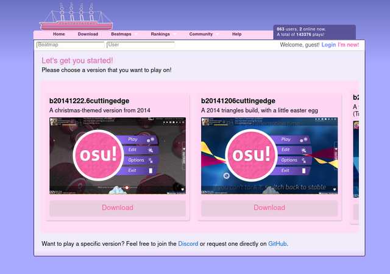
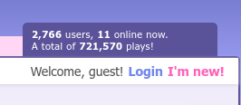
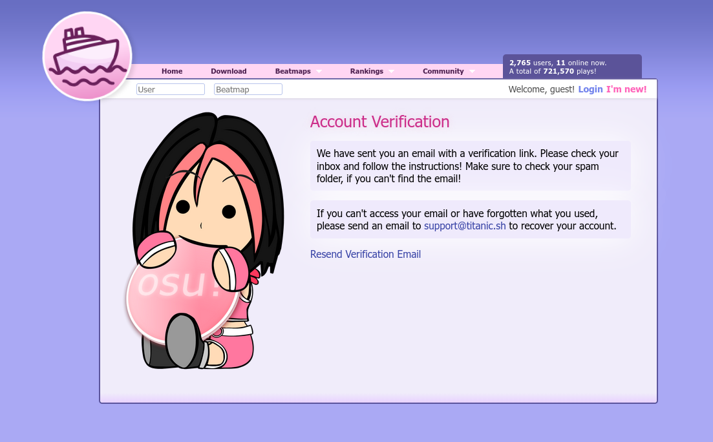
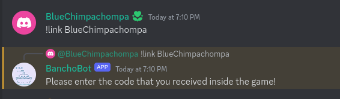
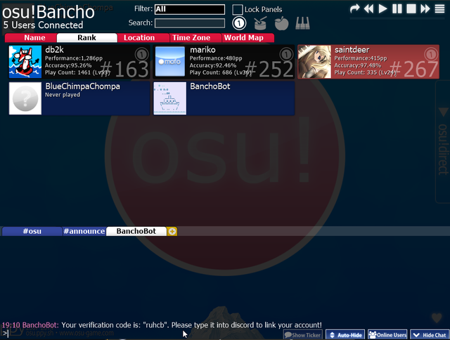
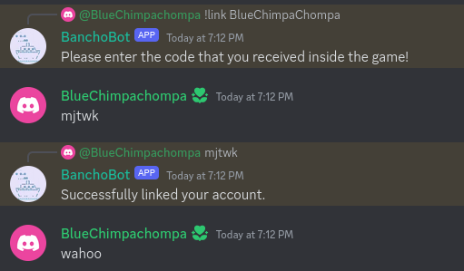

# Installation

To begin playing on Titanic! you can head over to the [downloads page](https://osu.titanic.sh/download/) and pick any client from as old as 2007 up to 2014.

After it finishes installing, all you have to do is extract the folder and double-click `osu!.exe`.

There is a chance that Windows Defender may block it, since the game is unsigned (a certificate for that would cost 200$).

## Registering an account

To register an account you can go to the [registration page](https://osu.titanic.sh/account/register) by clicking on "I'm New!" (**Remember you are only allowed to have *ONE* account EVER!**)

After you create your account you will be prompted to verify your email:

## Discord Bot

If you want to use the bot on our [Discord](https://discord.gg/3VeNPgDUrK) all you have to do is type `!link <username>` and you will be sent a verification code in-game.

<!--## Linux Installation-->

