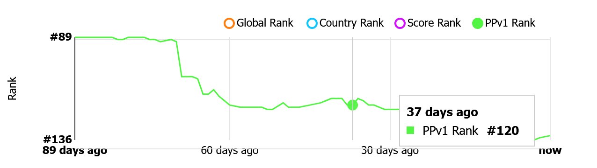

# Performance Points v1  
  
Performance Points v1 (PPv1) is a ranking metric that aimed to be more contextually relevant to a continuous game like osu!, acting as a successor to the ranked score ranking system.  
  
PPv1 aimed to shift the focus from being on the amount of time played to the actual skill of the player relative to other players with more sample data (that applies to the formulaes used) rewarding more performance points.  

[TOC]  

## History  
  
This is an attempt at recreating the original ppv1 system from back in the day. You can find the official explanation of the old system [here](https://osu.ppy.sh/wiki/en/Performance_points/ppv1). Expect inaccuracies to the original system. This is not a perfect recreation.  
  
The PPv1 metric was initially released in April, 2012 as '???' during a testing phase, being finally renamed to "pp" (Performance Points) on the 17th April 2012. In July 24, the (20120722-24) osu! release replaced the Ranked score system with Performance Points for every 30 minutes. At August 16, the pp system was eventually updated real-time, it was later replaced by Performance Points v2 (PPv2) due to the neglect towards higher difficulty favourment.  
  
The changelog can be found [here](https://github.com/osuTitanic/titanic/commits/deck-rewrite/internal/performance/ppv1.go).  
  

## Location  
  
The performance points ranking can be found [here](https://osu.titanic.sh/rankings/osu/ppv1).  
  
It can also be found from the bar at the top (Rankings -> PPv1).  

## Calculation  
### The calculation formulaes involved use several skill evaluating factors:  

  
* Favours skill, and cannot be truly farmed, when a map exceeds 30% pass rate (determined via pass count divided by play count) the performance points awarded is reduced to 20% of what would otherwise be recieved.
  
* Map playcount is taken into consideration, a higher playcount will result in a higher performance point reward (the pass rate multiplier will still apply however if the pass rate equates to, or exceeds 30%).
   
* Scores achieved are weighted to encourage achievement of higher value plays, lower value plays are weighted harshly very quickly while higher value plays reward immensely.
   
* Weighs difficult maps higher based on a system separate to star rating, this system is capped at a value of 5.
  
* Diminishes naturally over time (if you are inactive for a year you'll lose up to half your score).
  
* There are no penalties for "bad" scores — only rewards for good ones.
  
* All [ranked](https://osu.titanic.sh/beatmapsets/?category=2) and [approved](https://osu.titanic.sh/beatmapsets/?category=5) maps are included in calculation.
  
* Placing higher on a map's leaderboard will result in a higher reward, placing lower will result in a decrease in your reward.
  
* Accuracy is considered, this increases the performance points awarded exponentially, with the bonus of SS (100% accuracy, all objects hit are 300's) awarding a multiplier of 1.36x and a perfect full combo (no dropped slider ends and no combo break) awarding 1.2x (these can only be applied independently, with the greater being applied, e.g. SS recieves no perfect full combo multiplier).
  
* Play mod weightings are slightly adjusted for fairness, Hard Rock and Double Time both give a multiplier of 1.1x, Double Time provides a higher score multiplier however, meaning a higher potential placement on the leaderboard. Easy + Half Time give a multiplier of 0.2x. Hidden and Flashlight provide no performance point multiplier, however they will provide higher score multiplier, resulting in a higher potential placement on the map's leaderboard.
  
* Updated in real-time.  

                                                                                                               
## Increasing your rank  
### Your performance rank is predominantly based on your performance on individual maps. The easiest way to improve it is to improve your rank on difficult songs:  
  
* Play better, rank higher on songs by improving acc, combo and applying more mods.
  
* Work on getting some really high ranks, not thousands of "okay" ranks, a higher value play will be weighted less harshly thus rewarding far more.
  
* Get higher accuracy (even 1% difference can help light-years!).
  
* Rank on highly contested maps, do be wary of high pass rate however.
  
* Achieve scores on harder difficulties (ideally if you can achieve a high accuracy full combo play).
  
* Improve old records.
  
* Get "SS" grade instead of just Full Combo/Perfect.  

                                           
## Formulae Index
  
* Pass Rate: (passCount) / (playCount) > 0.3 = 0.2, (passCount) / (playCount) < 0.3 = 1.
  
* Play Count: (3.6) * (0.24) * ( (playCount) ^ (0.4) ), playCount < 1 = 1.
  
* Weighting: pp * ( (0.994) ^ (index) ).
  
* Difficulty: (difficultyEyupStars) < 5 = (difficultyEyupStars) ^ 4, (difficultyEyupStars) > 5 = (5) ^ (4).
  
* Decay: (1 - (0.01 * ( ( (scoreAgeDays) / (10) ) ) ) > 0.01 = [Result of formula], [Result of formula] < 0.01 = 0.01.
  
* Leaderboard Placement: (rank + 1) ^ (0.8).
  
* Accuracy: (accuracy) ^ (15).
  
* Perfect Full Combo & SS: PFC = 1.2x, SS = 1.36x.
  
* Mods: HR = 1.1x, DT = 1.1x, EZHT = 0.2x, NM = 1.0x.

## Picture  
#### Picture example. PPv1 can be found at your account page under "General" tab and selecting "PPv1 Rank". 

                                                                                                               
                                                                                                               
