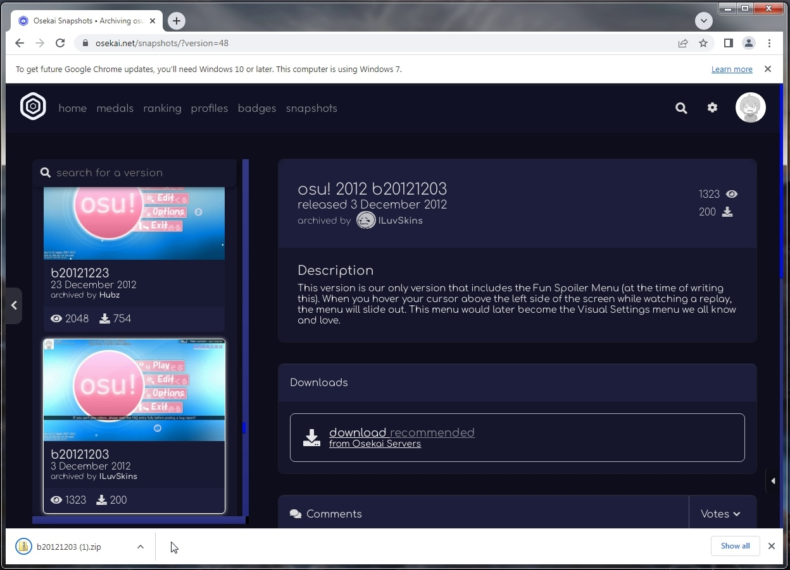
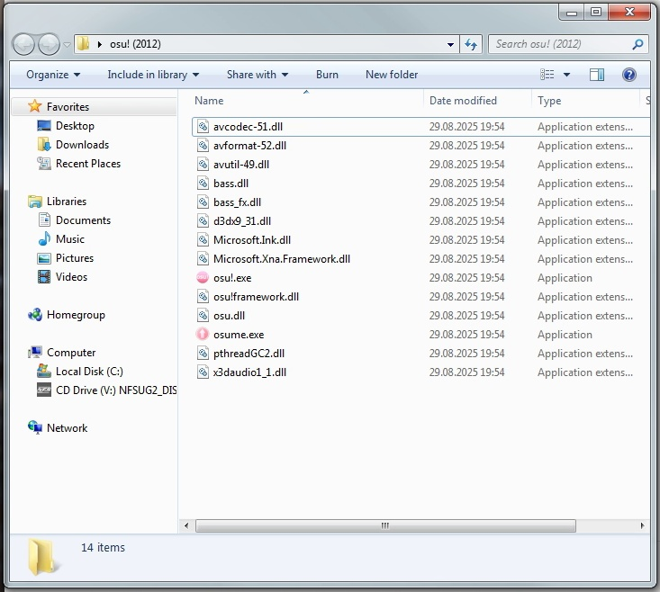
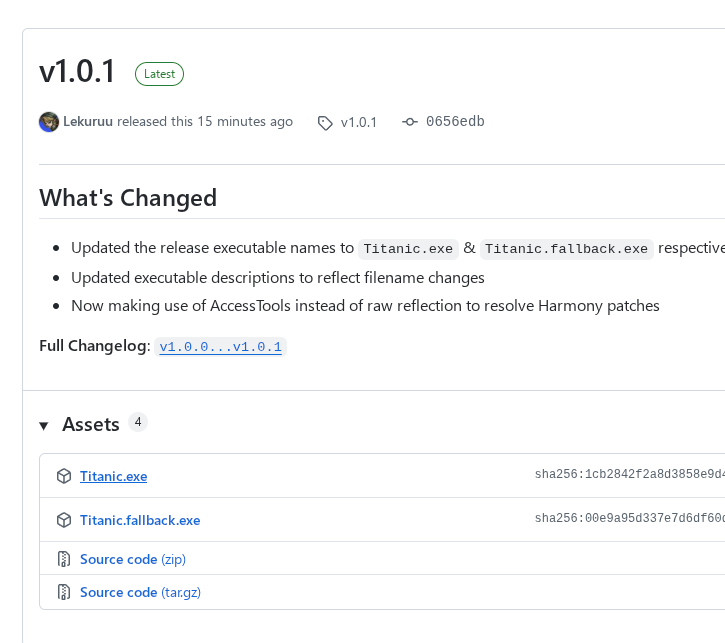
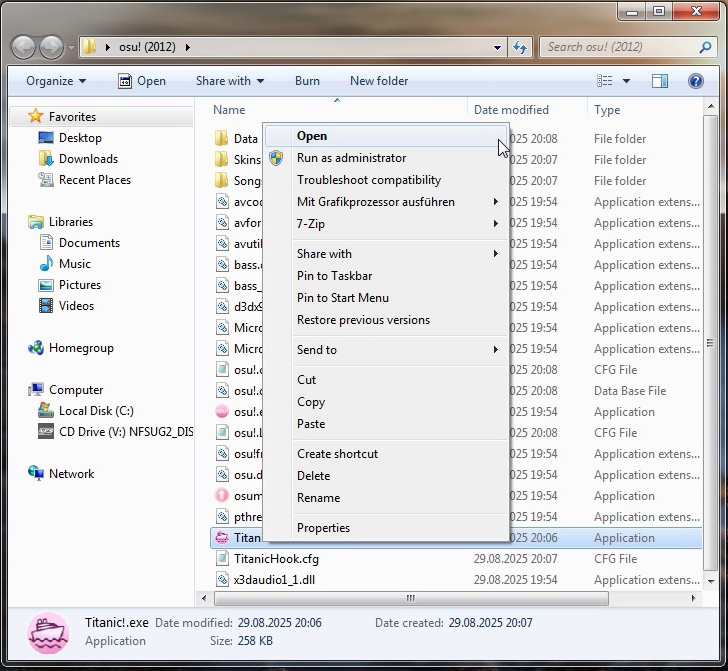
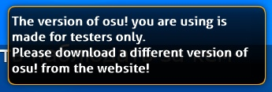

# Titanic! Patcher

[TOC]

Introducing **Titanic! Patcher** - a new way of playing Titanic.  
Instead of downloading a pre-patched version from Titanic's servers, you can now use the original, untouched game files.

Follow the steps below to get everything set up!

## Step 1: Download osu! from Osekai Snapshots

The first step is to obtain the game itself.
Most people use [Osekai Snapshots](https://osekai.net/snapshots/) for this purpose, as it provides a large collection of archived versions.

## Step 2: Download the latest version of Titanic! Patcher

Titanic! Patcher is fully open-source and available for download on the GitHub [Release Page](https://github.com/osuTitanic/hook/releases).  
Find the latest version and download the **Titanic.exe** file.

Once downloaded, place the *.exe* file into your osu! installation folder and double-click it. That’s it - you’re ready to go!

### Choosing the right .NET Framework version

Generally, it is recommended to download the regular "Titanic.exe" file, as it has the widest range of compatibility. However, there is an additional "fallback" version of the patcher, using .NET 2.0, which is compatible with versions before the middle of 2015 *only*. It might fix some unexpected issues, and it also works on very old operating systems (Windows 2000 and Windows XP before Service Pack 2).

### Whitelisted Clients

<!--
Current image is outdated, we'll have to create a new one

-->

You may see a message saying:  
**"The version of osu! you are using has not been whitelisted. Please download a different version of osu! from the website!"**.

This simply means that the version you're trying to run has not been tested with Titanic! yet, and thus is not whitelisted. You can still use it to chat and play in multiplayer lobbies, but score submission will be disabled. If you believe that your version should be whitelisted, please contact the developers or make a forum post about it in the [Feature Requests](https://osu.titanic.sh/forum/6) forum.
